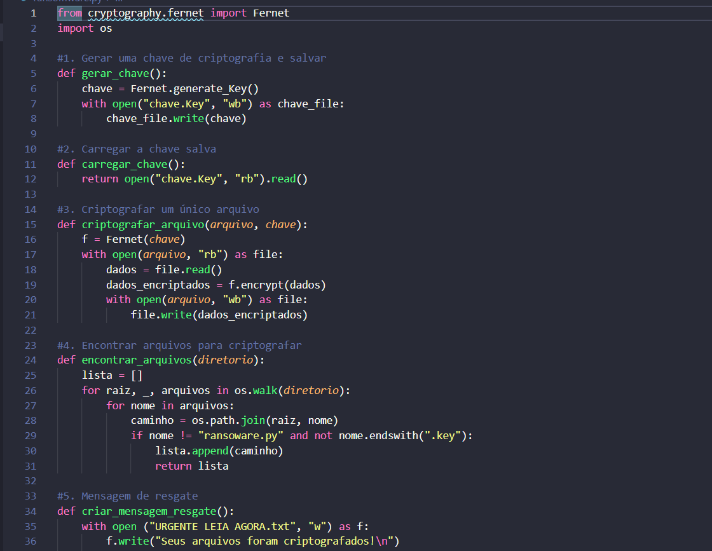

# projeto2bootcampp
# Ransoware

- Importar cryptography.fernet
Fernet
- Gerar uma chave de criptografia e salvar
Chave vai ser salva em um arquivo no caso chave.key
- Carregar a chave do arquivo
- Criptografar dados
## Atenção
- Cuidado para não criptografar o script r a chave
- Criar a mensagem de resgate
Função principal

# Descriptografar
- Pegar dados embaralhados e descriptografar
- carregar a chave do arquivo chave.key